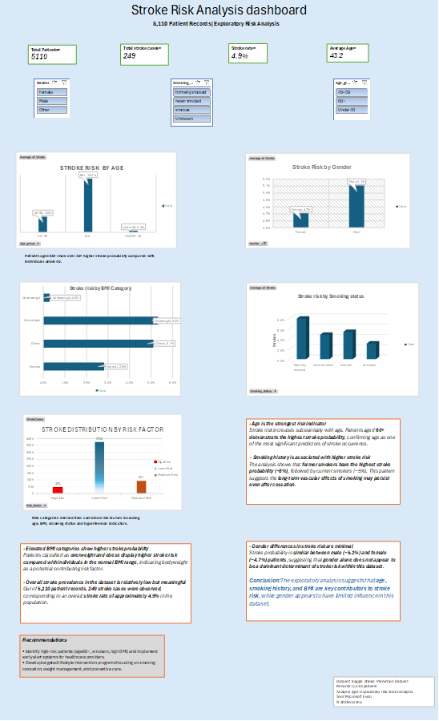

# 🩺 Stroke Risk Analysis Dashboard

An interactive healthcare analytics dashboard built in Microsoft Excel to analyze stroke risk using demographic, clinical, and lifestyle data from **5,110 patient records**. The project demonstrates data cleaning, exploratory data analysis (EDA), feature engineering, KPI reporting, and interactive dashboard design.

---

## 📸 Dashboard Preview



---

## 📋 Project Overview

Stroke is one of the leading causes of death and disability worldwide. This project explores key factors associated with stroke risk by transforming raw healthcare data into an interactive Excel dashboard.

The dashboard enables users to filter and analyze stroke probability across different patient groups based on demographic and health-related characteristics.

---

## 🎯 Objectives

- Analyze stroke risk across different population groups.
- Identify major risk factors associated with stroke.
- Build an interactive dashboard for healthcare data exploration.
- Present insights using clear visualizations and KPIs.

---

## 🛠️ Tools & Techniques

- Microsoft Excel
- Data Cleaning
- Data Transformation
- Feature Engineering
- Pivot Tables
- Pivot Charts
- Interactive Slicers
- KPI Dashboard Design

---

## 📊 Key Performance Indicators (KPIs)

| Metric | Value |
|---------|-------|
| Total Patients | 5,110 |
| Stroke Cases | 249 |
| Stroke Rate | 4.9% |
| Average Patient Age | 43.2 Years |

---

## 📈 Dashboard Features

- Stroke Risk by Age Group
- Stroke Risk by Gender
- Stroke Risk by Smoking Status
- Stroke Distribution by BMI Category
- Stroke Distribution by Risk Factors
- Interactive Filters (Gender, Smoking Status, Age Group)

---

## 🔍 Key Insights

- Patients aged **60+** show the highest stroke probability.
- Former smokers exhibit a higher stroke risk than current and never smokers.
- Overweight and obese individuals have an elevated stroke probability.
- Gender alone shows minimal impact on stroke occurrence within this dataset.

---

## 💡 Recommendations

- Develop early risk identification systems for high-risk patients.
- Promote smoking cessation programs.
- Encourage healthy weight management.
- Improve preventive healthcare screening for vulnerable populations.

---

## 📂 Repository Structure

```
stroke-risk-analysis-dashboard
│
├── dashboard
│   ├── Stroke_Risk_Analysis_Dashboard.xlsx
│   └── Stroke_Risk_Analysis_Dashboard.pdf
│
├── images
│   └── dashboard-overview.png
│
├── docs
│   └── Project_Description.pdf
│
└── README.md
```

---

## 📁 Files Included

| File | Description |
|------|-------------|
| Stroke_Risk_Analysis_Dashboard.xlsx | Interactive Excel dashboard |
| Stroke_Risk_Analysis_Dashboard.pdf | Dashboard in PDF format |
| dashboard-overview.png | Dashboard preview image |
| Project_Description.pdf | Detailed project documentation |

---

## 🚀 Future Improvements

- Develop the dashboard in Power BI.
- Perform advanced statistical analysis using Python.
- Build predictive machine learning models for stroke risk.
- Integrate real-time healthcare data sources.

---

## 👩‍💻 Author

**Varsha**

Healthcare Data Analyst | Health Informatics Enthusiast

---

⭐ If you found this project interesting, feel free to star the repository.
